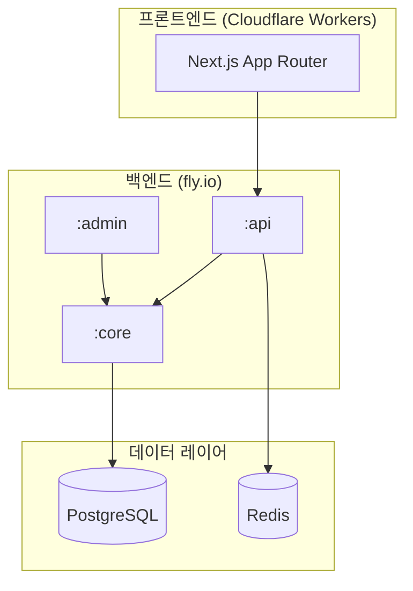

[🇺🇸 English](README.md)

# Bias Song Finder

> 스무고개 방식의 퀴즈로 기억 속 K-pop 노래를 찾아주는 앱

**Live**: https://biassongfinder.com

현재 **SHINee**와 **f(x)**를 지원합니다. 더 많은 아티스트가 추가될 예정입니다.

---

## 개요

사용자가 어렴풋이 기억하는 노래에 대한 질문들 — 인트로를 부르는 멤버, 분위기, 뮤직비디오 유무, 활동 시기 등 — 에 답하면, 앱이 후보곡을 좁혀가며 최종적으로 해당 곡을 찾아줍니다.

백엔드는 답변을 기반으로 후보곡을 필터링하고, 가장 효과적으로 후보를 구분할 수 있는 다음 질문을 동적으로 선택하여, 후보가 하나로 좁혀지면 결과를 반환합니다.

---

## 기술 스택

| 레이어 | 기술 |
|-------|-----------|
| **백엔드** | Kotlin 1.9 / Spring Boot 3.4 / Java 21 |
| **데이터베이스** | PostgreSQL 17 (schema-per-tenant 멀티테넌시) |
| **캐시 / 세션** | Redis (Upstash) |
| **백엔드 배포** | fly.io (dev + prod) |
| **프론트엔드** | Next.js 16 (App Router) / TypeScript / React 19 |
| **UI** | Tailwind CSS v4 / shadcn/ui / Framer Motion |
| **상태 관리** | Zustand |
| **다국어** | 커스텀 구현 (한국어 / 영어) |
| **프론트엔드 배포** | Cloudflare Workers (OpenNext) |

---

## 아키텍처

### 주요 설계 포인트

- **헥사고날 아키텍처**: 각 모듈이 HTTP 레이어와 비즈니스 로직을 깔끔하게 분리
- **멀티테넌시**: 각 아티스트 그룹이 데이터베이스 수준에서 완전히 격리되며, 다중 레이어 테넌트 해석 적용
- **세션 기반 게임 플로우**: 로그인 불필요. 경량 세션 메커니즘으로 사용자 계정 없이 퀴즈 상태 추적
- **엣지 배포**: 프론트엔드를 Cloudflare Workers에서 실행하여 글로벌 저지연 서비스 제공

---

## 문서

- [아키텍처](docs/ko/architecture.md) — 시스템 설계, 모듈 구조, 멀티테넌시
- [백엔드](docs/ko/backend.md) — 백엔드 기술 스택 상세
- [프론트엔드](docs/ko/frontend.md) — 프론트엔드 기술 스택 상세
- [도메인 모델](docs/ko/domain-model.md) — 엔티티와 관계
- [API 개요](docs/ko/api-overview.md) — 세션 플로우와 API 설계 철학
