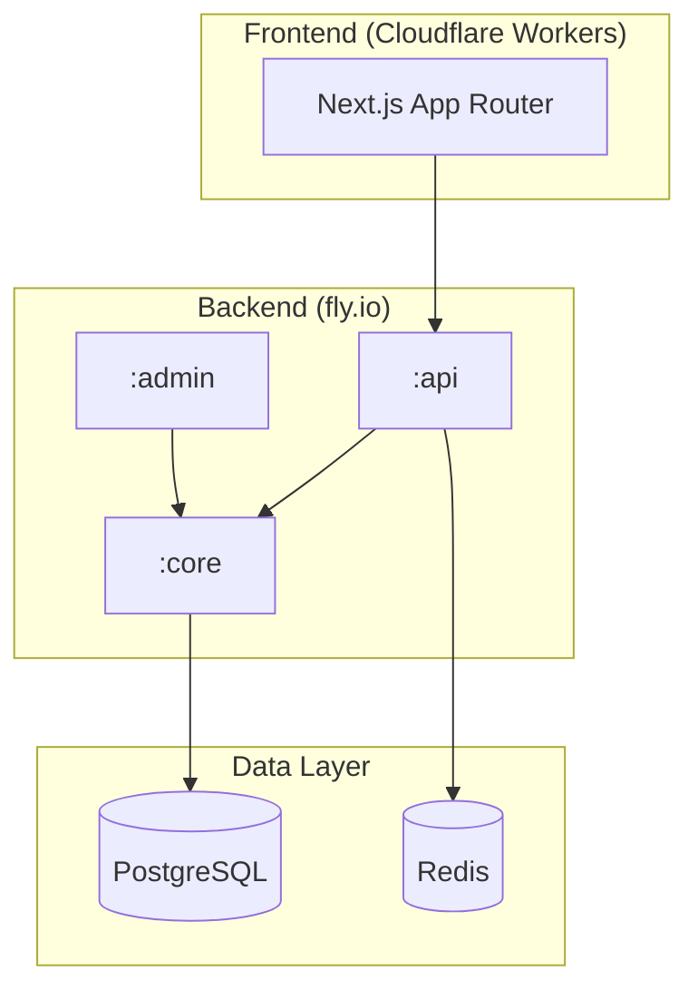

[🇰🇷 한국어](README.ko.md)

# Bias Song Finder

> K-pop song search app using a 20-questions-style quiz to find that half-remembered song.

**Live**: https://biassongfinder.com

Currently supports **SHINee** and **f(x)**. More artists coming soon.

---

## Overview

Users answer a series of questions about a song they vaguely remember — the member who sings the intro, the mood, whether it has a music video, the era — and the app narrows down candidates until it finds the song.

The backend filters candidates based on answers, selects the next most-differentiating question dynamically, and returns a result when only one candidate remains.

---

## Tech Stack

| Layer | Technology |
|-------|-----------|
| **Backend** | Kotlin 1.9 / Spring Boot 3.4 / Java 21 |
| **Database** | PostgreSQL 17 (schema-per-tenant multi-tenancy) |
| **Cache / Session** | Redis (Upstash) |
| **Backend Deploy** | fly.io (dev + prod) |
| **Frontend** | Next.js 16 (App Router) / TypeScript / React 19 |
| **UI** | Tailwind CSS v4 / shadcn/ui / Framer Motion |
| **State** | Zustand |
| **i18n** | Custom (Korean / English) |
| **Frontend Deploy** | Cloudflare Workers (OpenNext) |

---

## Architecture

### Key Design Points

- **Hexagonal Architecture**: Each module cleanly separates the HTTP layer from business logic
- **Multi-Tenancy**: Each artist group is fully isolated at the database level with multi-layer tenant resolution
- **Session-based game flow**: No login required. A lightweight session mechanism tracks quiz state without user accounts
- **Similarity-based fallback**: When the quiz can't pin a single song, the backend recommends the closest matches via a weighted similarity engine
- **Edge deployment**: Frontend runs on Cloudflare Workers for global low-latency delivery

---

## Documentation

- [Architecture](docs/architecture.md) — System design, module structure, multi-tenancy
- [Backend](docs/backend.md) — Backend tech stack details
- [Frontend](docs/frontend.md) — Frontend tech stack details
- [Domain Model](docs/domain-model.md) — Entities and relationships
- [API Overview](docs/api-overview.md) — Session flow and API design philosophy
