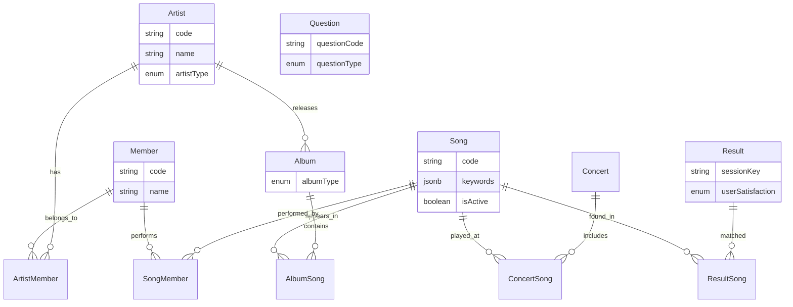

[🇰🇷 한국어](ko/domain-model.md)

# Domain Model

## Entity Overview

## Core Entities

- **Artist** — Artist group with bilingual name support and type classification (group/unit/solo)
- **Member** — Individual member with bilingual name
- **Album** — Album belonging to an Artist, categorized by type (single, EP, LP, etc.)
- **Song** — Track with searchable keywords, genre tags, streaming platform links, and various metadata flags for quiz filtering. Artist association is derived through Album, not a direct relationship
- **Concert** — Concert event with date, venue, and setlist

---

## Relationships

All many-to-many relationships use explicit join entities with composite keys.

| Relationship | Purpose |
|-------------|---------|
| Artist ↔ Member | Tracks current/past membership |
| Album ↔ Song | Track listing with ordering |
| Concert ↔ Song | Setlist with ordering |
| Result ↔ Song | Supports multi-song results |
| Song ↔ Member | Which members appear on a track (inactive but available)|

---

## Quiz Flow Entities

- **Question** — A quiz question with type classification and a target song attribute for filtering. Questions can be chained in sequence and support multiple answer formats
- **Result** — Quiz result tied to a session, with optional user satisfaction feedback

---

## Design Patterns

- **Soft Delete** — Entities use logical deletion instead of hard deletion
- **Audit Fields** — Automatic timestamp management via JPA lifecycle callbacks
- **Bilingual Fields** — Korean and English variants for user-facing text
- **JSONB Columns** — List-type fields stored as PostgreSQL JSONB to avoid unnecessary join tables
