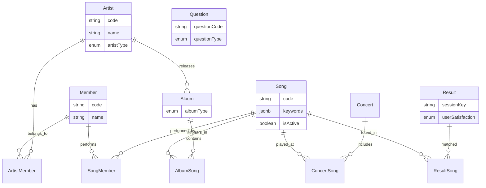

[🇺🇸 English](../domain-model.md)

# 도메인 모델

## 엔티티 개요

## 핵심 엔티티

- **Artist** — 아티스트 그룹. 이중 언어 이름 지원 및 타입 분류 (그룹/유닛/솔로)
- **Member** — 개인 멤버. 이중 언어 이름 지원
- **Album** — 아티스트에 속한 앨범. 타입별 분류 (싱글, EP, LP 등)
- **Song** — 트랙. 검색 키워드, 장르 태그, 스트리밍 플랫폼 링크, 퀴즈 필터링을 위한 다양한 메타데이터 플래그 보유. 아티스트 연관은 직접 관계가 아닌 Album을 통해 도출
- **Concert** — 콘서트 이벤트. 날짜, 장소, 세트리스트 포함

---

## 관계

모든 다대다 관계는 복합 키를 가진 명시적 조인 엔티티를 사용합니다.

| 관계 | 목적 |
|-------------|---------|
| Artist ↔ Member | 현재/과거 멤버십 추적 |
| Album ↔ Song | 순서가 있는 트랙 리스트 |
| Concert ↔ Song | 순서가 있는 세트리스트 |
| Result ↔ Song | 다중 곡 결과 지원 |
| Song ↔ Member | 트랙에 참여한 멤버 (비활성이지만 사용 가능) |

---

## 퀴즈 흐름 엔티티

- **Question** — 타입 분류와 대상 곡 속성 필터링을 가진 퀴즈 질문. 순차적 연결이 가능하며 다양한 답변 형식 지원
- **Result** — 세션에 연결된 퀴즈 결과. 선택적 사용자 만족도 피드백 포함

---

## 설계 패턴

- **소프트 딜리트** — 하드 딜리트 대신 논리적 삭제 사용
- **감사 필드** — JPA 라이프사이클 콜백을 통한 자동 타임스탬프 관리
- **이중 언어 필드** — 사용자 대면 텍스트의 한국어/영어 변형
- **JSONB 컬럼** — 불필요한 조인 테이블을 회피하기 위해 리스트형 필드를 PostgreSQL JSONB로 저장
